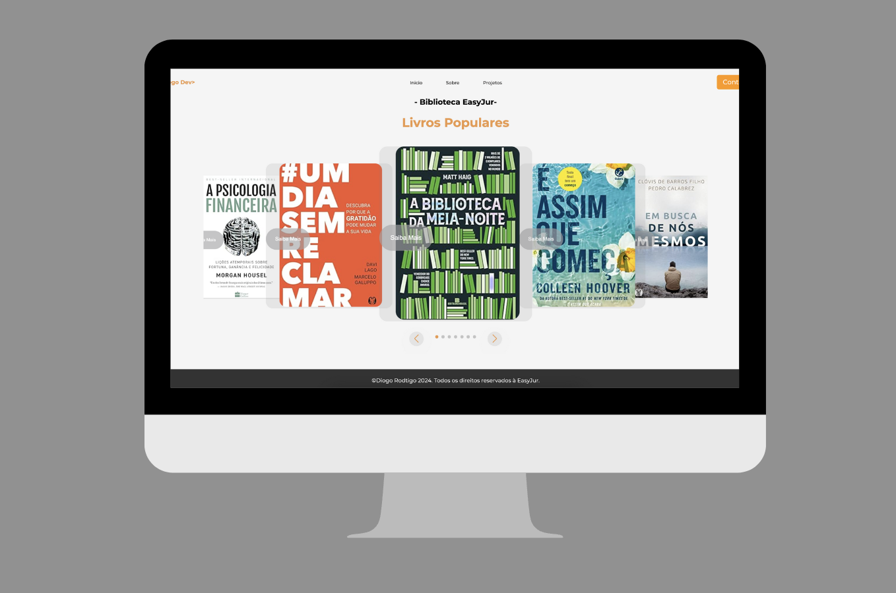

## Visão

O **Biblioteca EasyJur** é uma aplicação responsiva para desktop e dispositivos móveis, desenvolvida como parte de um teste técnico para a EasyJur, com o objetivo de avaliar conhecimentos em HTML5, CSS, JavaScript e jQuery.

O projeto foi criado para simular um carrossel de livros, onde a principal funcionalidade é a reutilização do componente.

## Tecnologias Utilizadas

O projeto **Biblioteca EasyJur** foi desenvolvido utilizando as seguintes tecnologias:

- **HTML 5**: Linguagem de marcação para construção de páginas Web.
- **CSS**: Linguagem de marcação para estilização.
- **Java Script**: Linguagem de programação para funcionalidades.
- **Swiper**: Biblioteca de JavaSript de apresentação de slides.

## Arquivos de Componentes:

- [BookCarouselSlideFactory.js](js/slider/BookCarouselSlideFactory.md)
- [BookDetailModalController.js](js/modal/BookDetailModalController.md)

## Como Clonar e Executar o Projeto

### Pré-requisitos

- Node.JS instalado
- Npm ou Yarn instalado

## Passos

1. Clone o repositório do **Biblioteca EasyJur**:

```bash
https://github.com/DiogooRodrigoo/libraryEasyJur.git
```

2. Acesse o diretório do projeto:

```bash
cd libraryEasyJur
```

3. Intale as dependências do projeto:

```bash
npm install
```

ou

```bash
yarn insyall
```

4. Execute o projeto:

Este projeto é uma aplicação estática e pode ser executado diretamente abrindo o arquivo `index.html` em um navegador. Para um ambiente de desenvolvimento mais avançado, você pode usar um servidor local, como o Live Server do VS Code ou o http-server do Node.js.

1.1 Instale a estensão Live Serve e clique com o botão direito no arquivo `index.html`e selecione **Open with Live Server**

1.2 Utilizando o http-serve

```bash
npm install -g http-server
```

Navegue até o diretório do projeto e execute

```bash
http-server
```

5. Acesse o aplicativo em seu navegador em [http://localhost:8080](http://localhost:8080).

## Screenshots



## Demonstração


---

Com essas orientações, você conseguirá copiar o repositório, instalar as dependências e rodar o projeto **Biblioteca EasyJur** no seu ambiente local. Caso precise de mais assistência, não hesite em me procurar.

Desenvolvido por Diogo Rodrigo Pedreira Galvão, 2024.
Todos os direitos de uso de imagem e atribuições deste trabalho estão diretamente relacionados à empresa EasyJur.
